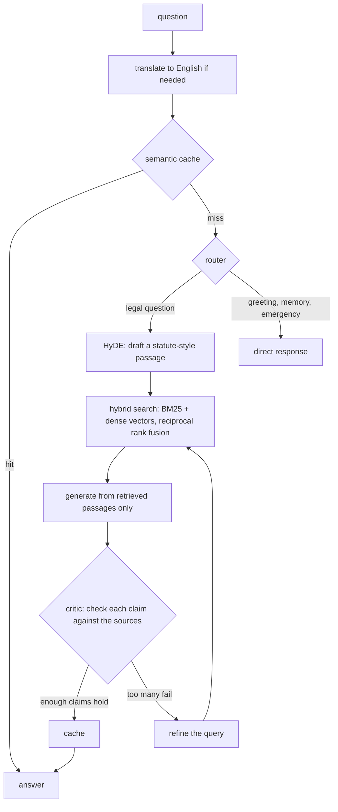
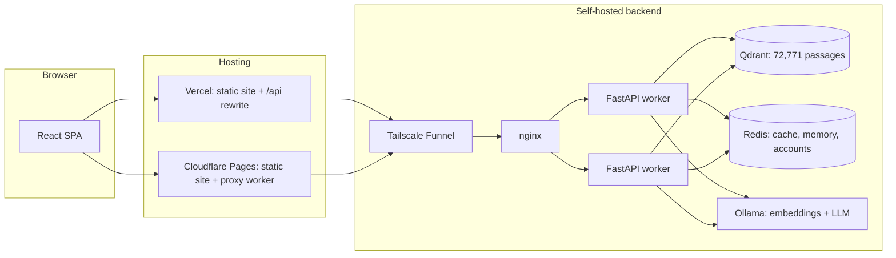

# Vidhi

Plain-language answers to questions about Indian law, drawn from the text of 494 official documents, with the exact sections cited. Available in eleven languages.

**Live:** [project-vidhi.vercel.app](https://project-vidhi.vercel.app). The backend is self-hosted, so it may occasionally be offline.


## What it does

You ask a question the way you'd ask a friend: "My employer hasn't paid my salary for two months. What can I do?" Vidhi searches a library of Indian acts, rules, government guidelines and landmark judgments, writes an answer from the passages it found, checks each claim in that answer against those passages, and streams the result with its sources.

- **Grounded answers.** Every answer lists the sections it relied on, and a verification step can send it back for another search before you see it.
- **Eleven languages.** English, Hindi, Bengali, Punjabi, Gujarati, Marathi, Tamil, Telugu, Kannada, Malayalam and Odia, for both the interface and the answers, including native digits and the official names of acts.
- **Deep Search** for questions that span several laws: the agent plans follow-up searches and shows each step.
- **A searchable library** of every document it answers from, with titles translated into each language.
- **PDF export** of any answer with its question and sources.
- **Accounts** that keep conversations for 90 days, with export and one-click deletion of chats or the whole account.

<p>
  
  
</p>

## How an answer is made



1. **Retrieval.** Legal text is dense with exact tokens (section numbers, act names, years) that embeddings alone tend to blur, so every query runs through a BM25 index and a dense vector index in parallel, merged with reciprocal rank fusion. For legal questions the model first drafts a hypothetical statute-style answer and searches with that, which closes the gap between how people phrase problems and how laws are written.
2. **Generation.** The retrieved passages go into the prompt as the only material the answer may use, and the answer cites them.
3. **Verification.** The draft is split into atomic claims, and each claim is matched to the retrieved passages by embedding similarity. A separate check discards claims that cite a year absent from the sources. If too many claims fail, the graph refines the query and searches again, up to two more times. Only answers that pass are cached.

Questions in other languages are translated to English on the way in and answers translated back on the way out, so retrieval and verification are tuned once and serve every language.

## Results

Measured on the production setup with a fixed 25-question evaluation set and the cache cleared between runs (`scripts/evaluate_rag.py`, `scripts/benchmark_llm.py`).

**Choosing the model.** Eight prompts, the production prompt template, a fixed judge model:

| Model | Median time to first token | Median total | Grounding score |
|---|---|---|---|
| minimax-m3 (previous) | 4.54 s | 11.92 s | 0.679 |
| **gemma4:31b (chosen)** | **1.19 s** | **6.88 s** | **0.716** |
| gpt-oss:20b | 4.69 s | 9.63 s | 0.710 |

**Pipeline:** mean critic confidence 0.826, 4.6 sections cited per answer on average, a single uncached answer in about 24 seconds, and cached answers in under a second.

## Engineering notes

- **Verification is a graph node, not a label.** Built on LangGraph so the critic can loop back into retrieval, and so the same state machine drives a token-level event stream that the UI turns into live progress ("Searching the library…", "Checking each claim against the sources…").
- **Hindi retrieval was silently broken, then fixed.** An early ASCII-only tokenizer returned nothing for Hindi queries and section numbers. The tokenizer is now Unicode-aware (it also keeps Indic vowel signs attached to their words), and the index records its tokenizer version so an out-of-date index re-tokenizes itself on startup.
- **Translation pipeline for the interface.** English is the only locale anyone edits. `scripts/translate_locales.py` translates new or changed strings with the project's LLM and rejects any output that drops a `{{placeholder}}`, leaves Latin letters or ASCII digits, or isn't in the target script, retrying with the reason.
- **The LLM is configuration.** When free-tier models were retired mid-project, switching providers took a benchmark run and one setting, not a refactor.

## Security

- JWT sessions (7 days) with PBKDF2-SHA256 at 600,000 iterations and transparent rehashing of older hashes; login throttling and account lockout.
- Google sign-in accepts only access tokens issued to this app's OAuth client for a verified email.
- Guest limits enforced on the server: per visitor, per day, across all guests, and per connecting address. The last can't be dodged with forged forwarding headers.
- Conversation memory is keyed to the caller, not just a client-chosen session id; session ids are random UUIDs.
- Model output is sanitised Markdown with no raw HTML, images or inline handlers; the PDF export escapes everything it renders.
- A strict Content-Security-Policy and hardened headers on every host; admin and metrics endpoints require an admin secret or an allow-listed account; API docs are off by default.
- Databases and workers bind to localhost only; the API runs as a non-root user in Docker.

133 backend tests cover the pipeline and these guarantees (`make run-tests`).

## Architecture



**Backend:** Python 3.11, FastAPI, LangGraph, Qdrant, Redis, rank-bm25, Ollama (nomic-embed-text embeddings, gemma4 generation), PyJWT, Prometheus metrics, Server-Sent Events.
**Frontend:** React 18, Vite, Tailwind CSS 4, i18next, DOMPurify, jsPDF.
**Infrastructure:** nginx, Docker, Tailscale Funnel, Vercel, Cloudflare Pages.

## Running it locally

Prerequisites: Python 3.11+, Node 20+, Docker and [Ollama](https://ollama.com).

```bash
# Backend
python -m venv .venv && .venv/bin/pip install -r requirements.txt
ollama pull nomic-embed-text && ollama pull gemma4:31b-cloud
cp .env.example .env            # set JWT_SECRET; see the file for every option
make docker-up                  # Qdrant + Redis on localhost
make ingest                     # build the index from PDFs under data/raw
python scripts/rebuild_bm25.py
make run                        # API on http://localhost:8000

# Frontend
cd frontend && npm install
npm run dev                     # http://localhost:3000, proxies /api to the backend
```

To deploy the frontend, set the backend address in `frontend/vercel.json`; the Cloudflare build derives its proxy from the same file.

## Project layout

```
src/        FastAPI app, LangGraph nodes, agents, retrieval, caching, ingestion
frontend/   React app; locales in public/locales, Cloudflare worker in cloudflare/
scripts/    Evaluation, model benchmarking, index rebuilds, translation engine
tests/      Pytest suite
infra/      nginx configuration
```

## Limitations

- Vidhi gives legal information, not legal advice, and it can be wrong.
- The library is mostly central law; state laws and very recent amendments are largely missing.
- The evaluation set is small and generated from the corpus itself, so the grounding score is a useful proxy, not a substitute for review by a lawyer.
- The backend runs on personal hardware and a free-tier model provider, so availability isn't guaranteed.

## Authors

Sayan Das and Senjuti Ghosal. Released under the [MIT License](LICENSE).
